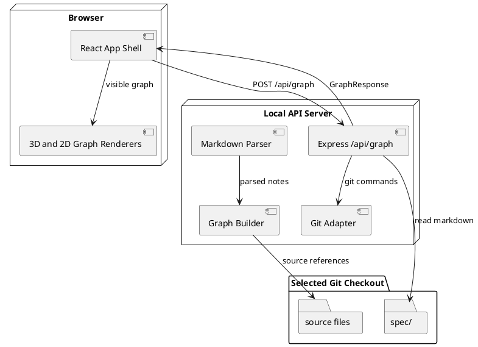

# System Architecture

The app is a local-first TypeScript web application with a React/Vite frontend, an Express backend, and shared graph contracts.

## Linked Capabilities

- [Repository Loading](../capabilities/Repository_Loading.md)
- [Spec Graph Extraction](../capabilities/Spec_Graph_Extraction.md)
- [3D Pyramid Visualization](../capabilities/3D_Pyramid_Visualization.md)
- [Horizontal Plane Visualization](../capabilities/Horizontal_Plane_Visualization.md)
- [Vertical Slice Traceability](../capabilities/Vertical_Slice_Traceability.md)

## Code

- backend/src/server.ts
- frontend/src/App.tsx
- shared/src/graph.ts
- frontend/vite.config.ts
