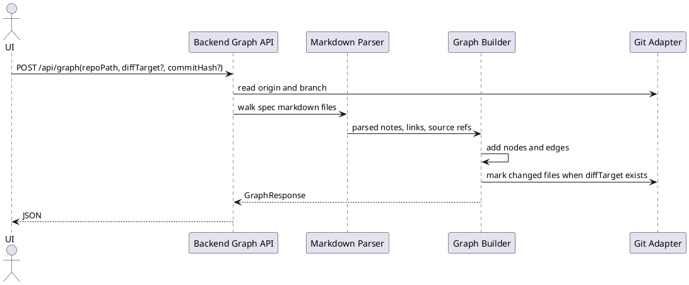

# Parse Spec Directory

The backend builds graph JSON by reading markdown notes from a local repository and deriving nodes, edges, source references, and git metadata.

## Modules

- [Backend Graph API](../modules/Backend_Graph_API.md)
- [Markdown Parser](../modules/Markdown_Parser.md)
- [Graph Builder](../modules/Graph_Builder.md)
- [Git Adapter](../modules/Git_Adapter.md)
- [GitHub URL Resolver](../modules/GitHub_URL_Resolver.md)

## Contracts

- [Parsed Markdown Note](../contracts/Parsed_Markdown_Note.md)
- [Graph Node](../contracts/Graph_Node.md)
- [Graph Edge](../contracts/Graph_Edge.md)
- [Graph Response](../contracts/Graph_Response.md)
- [Repository Scan Request](../contracts/Repository_Scan_Request.md)
