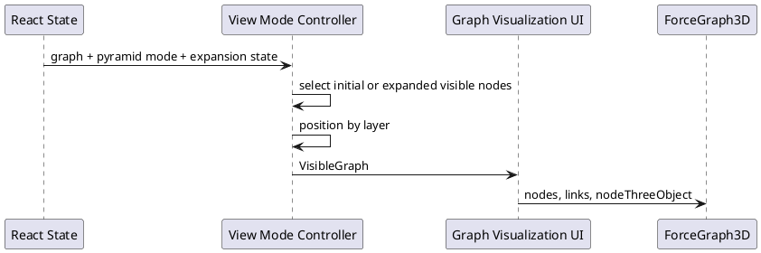

# Render 3D Pyramid Graph

The 3D Pyramid graph is rendered with `react-force-graph-3d`. Nodes receive fixed coordinates based on layer, and custom Three.js node objects provide colored spheres, labels, changed indicators, and diagram rings.

The initial Pyramid visible set is Vision and Capability nodes. Lower layers are revealed through [Expand 3D Pyramid Node](Expand_3D_Pyramid_Node.md).

## Modules

- [Frontend App Shell](../modules/Frontend_App_Shell.md)
- [View Mode Controller](../modules/View_Mode_Controller.md)
- [Graph Visualization UI](../modules/Graph_Visualization_UI.md)

## Related Flows

- [Expand 3D Pyramid Node](Expand_3D_Pyramid_Node.md)

## Contracts

- [Graph Node](../contracts/Graph_Node.md)
- [Graph Edge](../contracts/Graph_Edge.md)
