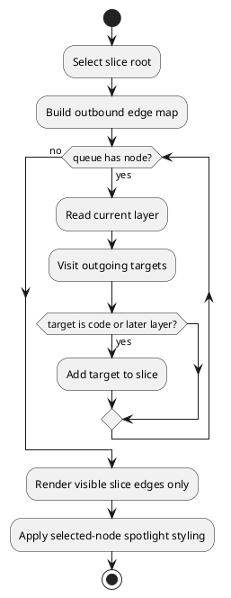

# Trace Vertical Feature Slice

The user selects a note from the slice root selector or selects a visible node before entering slice mode. The frontend traverses outgoing edges from that root to later layers and code nodes, then renders the result as a 2D vertical layout with the selected path emphasized as spotlight context.

## Capabilities

- [Vertical Slice Traceability](../capabilities/Vertical_Slice_Traceability.md)
- [Progressive Graph Exploration](../capabilities/Progressive_Graph_Exploration.md)

## Modules

- [View Mode Controller](../modules/View_Mode_Controller.md)
- [Graph Visualization UI](../modules/Graph_Visualization_UI.md)

## Contracts

- [Graph Node](../contracts/Graph_Node.md)
- [Graph Edge](../contracts/Graph_Edge.md)
