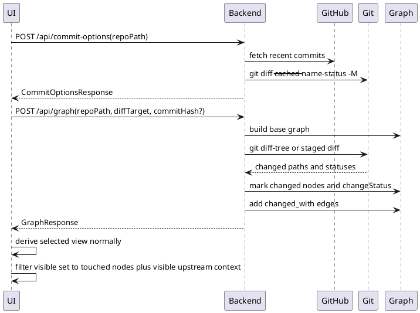

# Visualize Commit Changes

The commit filter lets the user choose recent GitHub commits by message and date/time, or choose `Staged Local Changes` when the local checkout has staged changes. The backend uses GitHub commit metadata for dropdown options, then uses local git diff commands to identify changed files, mark matching graph nodes, record change status metadata, create missing placeholder nodes for changed files, and attach commit URLs anchored to each changed file's diff section when GitHub metadata is available.

When a commit or staged diff target is active, the selected view behaves normally first, then the frontend filters that visible set to touched nodes plus visible upstream nodes that connect those changes back toward Vision. In the layered map, exploration still starts from Vision and touched top-level nodes, so unrelated unchanged capabilities are not seeded into the initial capability layer. Lower-layer changed nodes and their unchanged ancestors become visible when the user expands the relevant path. Deleted files may appear as placeholder nodes without reconstructed historical ancestry, but they still must be reached by the selected view before the commit filter can keep them visible.

## Capabilities

- [Commit Diff Visualization](../capabilities/Commit_Diff_Visualization.md)
- [Change-Aware System Understanding](../capabilities/Change_Aware_System_Understanding.md)

## Modules

- [Commit Diff Analyzer](../modules/Commit_Diff_Analyzer.md)
- [Git Adapter](../modules/Git_Adapter.md)
- [Graph Builder](../modules/Graph_Builder.md)
- [Graph Visualization UI](../modules/Graph_Visualization_UI.md)

## Contracts

- [Commit Filter Options](../contracts/Commit_Filter_Options.md)
- [Commit Diff Request](../contracts/Commit_Diff_Request.md)
- [Graph Node](../contracts/Graph_Node.md)
- [Graph Edge](../contracts/Graph_Edge.md)
