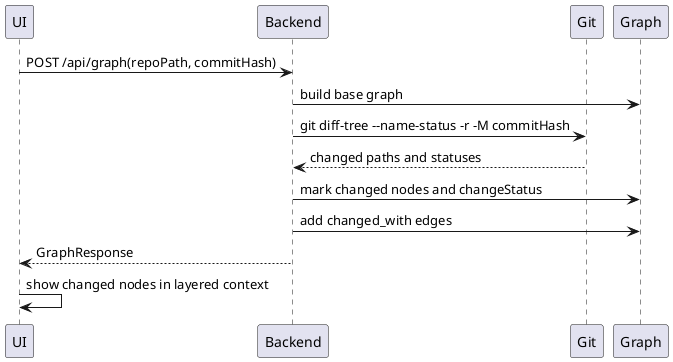

# Visualize Commit Changes

Commit mode lets the user enter a commit hash. The backend uses `git diff-tree --name-status` to identify changed files, marks matching graph nodes, records change status metadata, creates missing placeholder nodes for changed files, and attaches commit URLs.

Changed nodes are rendered in the change-aware layered map with available ancestors, direct descendants, directly connected context, and cross-cutting context. Deleted files may appear as placeholder nodes without reconstructed historical ancestry.

## Capabilities

- [Commit Diff Visualization](../capabilities/Commit_Diff_Visualization.md)
- [Change-Aware System Understanding](../capabilities/Change_Aware_System_Understanding.md)

## Modules

- [Commit Diff Analyzer](../modules/Commit_Diff_Analyzer.md)
- [Git Adapter](../modules/Git_Adapter.md)
- [Graph Builder](../modules/Graph_Builder.md)
- [Graph Visualization UI](../modules/Graph_Visualization_UI.md)

## Contracts

- [Commit Diff Request](../contracts/Commit_Diff_Request.md)
- [Graph Node](../contracts/Graph_Node.md)
- [Graph Edge](../contracts/Graph_Edge.md)
