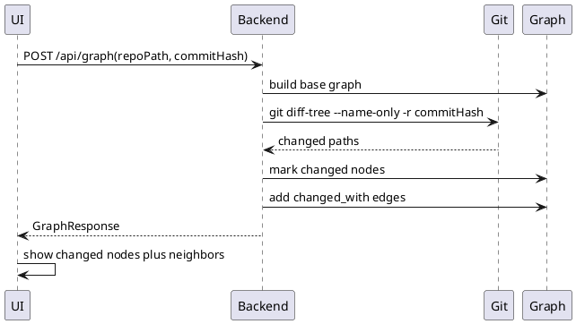

# Visualize Commit Changes

Commit mode lets the user enter a commit hash. The backend uses `git diff-tree` to identify changed files, marks matching graph nodes, creates missing code nodes for changed source files, and attaches commit URLs.

## Modules

- [Commit Diff Analyzer](../modules/Commit_Diff_Analyzer.md)
- [Git Adapter](../modules/Git_Adapter.md)
- [Graph Builder](../modules/Graph_Builder.md)
- [Graph Visualization UI](../modules/Graph_Visualization_UI.md)

## Contracts

- [Commit Diff Request](../contracts/Commit_Diff_Request.md)
- [Graph Node](../contracts/Graph_Node.md)
- [Graph Edge](../contracts/Graph_Edge.md)
