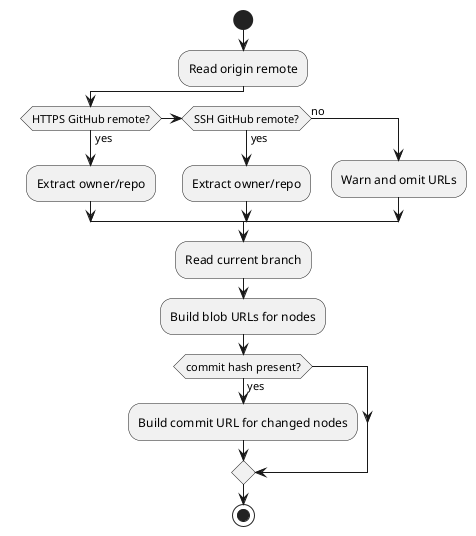

# GitHub URL Resolver

The GitHub URL resolver converts recognized GitHub remotes and repo-relative paths into browser URLs.

## Contracts

- [GitHub URL Resolution](../contracts/GitHub_URL_Resolution.md)
- [Graph Node](../contracts/Graph_Node.md)

## Code

- backend/src/server.ts
